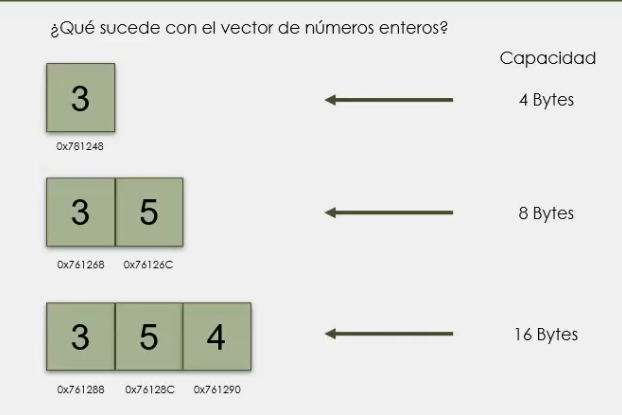

<div style="text-align: justify;">

# Clase #10 - Contenedores en C++


## Caracteristicas de los contenedores:
- Proporciona la implementacion de estructuras de datos comunmente usadas, por ejemplo: listas enlazadas y colas.

- Las estructuras de datos son implementadas usando contenedores, los cuales almacenan datos llamados elementos.

- Son colecciones homogeneas, es decir, se puede crear un contenedor para un solo tipo de dato.

- Es importante familiarizarse con las estructuras de datos disponibles para elegir la mas aparopiada para una tarea.

## Estructuras de datos para conenedores:

### Sequential containers:

```cpp
vector(dynamic array)       => // Un vector es una coleccion de elementos que se almacenan en memoria de forma contigua.
deque(double ended queue)   => // Una cola de doble extremo, es decir, que los elementos se pueden agregar o eliminar desde el frente o desde el final.
list                        => // Una lista es una coleccion de elementos que se almacenan en memoria de forma no contigua.
forward_list                => // Una lista enlazada simple es una coleccion de elementos que se almacenan en memoria de forma no contigua.
array                       => // Un array es una coleccion de elementos que se almacenan en memoria de forma contigua.
```

### Associative containers:

```cpp
map                        => // Un mapa se usa para almacenar datos en formato clave-valor.
multimap                   => // Un mapa desordenado, es decir, que los elementos se almacenan en orden aleatorio.
set                        => // Un conjunto se usa para almacenar datos unicos.
multiset                   => // Un conjunto desordenado, es decir, que los elementos se almacenan en orden aleatorio.
```
### Unordered associative containers:

```cpp
unordered_map              => // Un mapa desordenado se usa para almacenar datos en formato clave-valor.
unordered_multimap           => // Un mapa desordenado, es decir, que los elementos se almacenan en orden aleatorio.
unordered_set              => // Un conjunto desordenado se usa para almacenar datos unicos.
unordered_multiset         => // Un conjunto desordenado, es decir, que los elementos se almacenan en orden aleatorio.
```

### Container adapters:

```cpp
stack                       => // Una pila es una estructura de datos que se utiliza para almacenar elementos en orden LIFO (Last In First Out).
queue                       => // Una cola es una estructura de datos que se utiliza para almacenar elementos en orden FIFO (First In First Out).
priority_queue              => // Una cola de prioridad es una estructura de datos que se utiliza para almacenar elementos en orden de prioridad.
```


> IMPORTANTE 🥵: Se recomienda visitar la web [STL Containers](https://cppreference.com/) para poder ver todo lo relacionado con C++ de forma avanzada. Entre eso, los contenedores.

### Ejemplos:

```cpp
template<class T>

class pila{
    public:
        Pila( int = 10);
        ~Pila(delete [] ptrPila);
        bool push(const T &);
        bool pop( T&);
    private:
        int tamanio;
        int cima;
        T *ptrPila;

        bool estaVacia() const {return cima == -1;}
        bool estaLlena() const {return cima == tamanio -1;}
};
```
Pero te preguntaras, cual es la importancia de usar contenedores. Es sencillo, cuando tenemos programas muy grandes con muchas cosas y la maquina en la que se ejecuta el programa tiene poca memoria. Es importante optimizar el uso de la memoria, y los contenedores nos ayudan a hacerlo.

## Utilidad de contenedores de secuencias y para que

### Vector

- Almacena una secuencia de elementos y permite acceso a ellos a traves de sus diferentes metodos.

- Se puede pensar como un arreglo de elementos que crece dinamicamente.

- Al igual que un arreglo, los elementos del vector se almacenan contiguos en memoria.

- Se debe usar vectores cuando se necesita rapido acceso a los elementos, pero se debe eviatar añadir o remover elementos entre el arreglo.

Por ejemplo:

```cpp
#include <iostream>
#include <vector>

using namespace std;

int main(){
    vector<int> vec;
    vec.push_back(1);
    vec.push_back(2);
    vec.push_back(3);
    vec.push_back(4);
    vec.push_back(5);

    for(int i = 0; i < vec.size(); i++){
        cout << vec[i] << endl;
    }

    return 0;
}
```

1. Primero se incluye la libreria iostream y vector.
2. Se declara el vector `vector<int> vec;`
3. Se agrega elementos al vector con `vec.push_back(element);`
4. Se recorre el vector con un bucle for y se muestra el contenido de cada elemento:

```cpp
for(int i = 0; i < vec.size(); i++){ // Recorre el vector desde el primer elemento hasta el ultimo.
    cout << vec[i] << endl;          // Muestra el elemento en la posicion i.
}
```
> RECUERDA 🥶: Cada uno de los elementos que metes en un vector se guarda de forma consecutiva en memoria, es decir, uno detras del otro.

¿Qué sucede con el vector de numeros enteros?

Teniendo en cuenta que un `int` ocupa 4 bytes de memoria, si lo agregamos al `vector` entonces tiene un tamaño de 4 bytes. Mientras que, si agregamos otro elemento, como un 3 entonces la direccion de memoria en el `heap` donde se almacenan los elementos aumenta en 4 bytes, o dicho de otra forma, el vector crece en en potencia de 2 por cada elemento que se agrega. Es decir, si tenemos un `vector<int> vec =(1)` pero despues agregamos `vec.push_back(2)` entonces el vector pasaria a ser `vec =(1,2)` y ocuparia 8 bytes en memoria.



Debido a esto, el vector es eficiente en terminos de tiempo, ya que no es necesario recorrer el vector para agregar o eliminar elementos, pero es ineficiente en terminos de espacio. 


</div>  