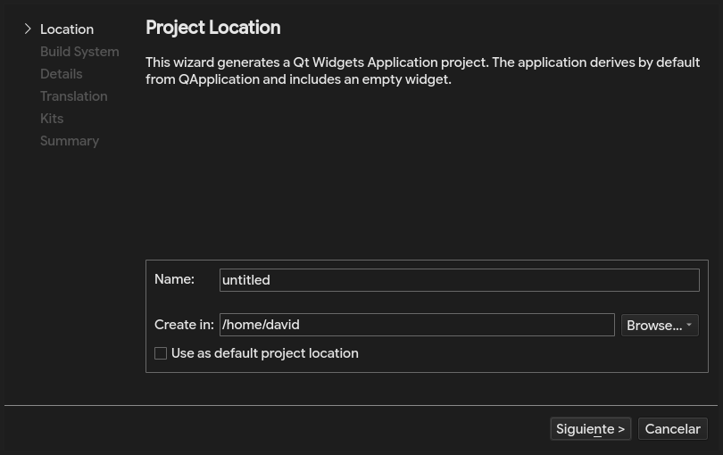
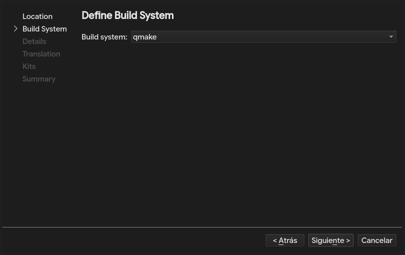
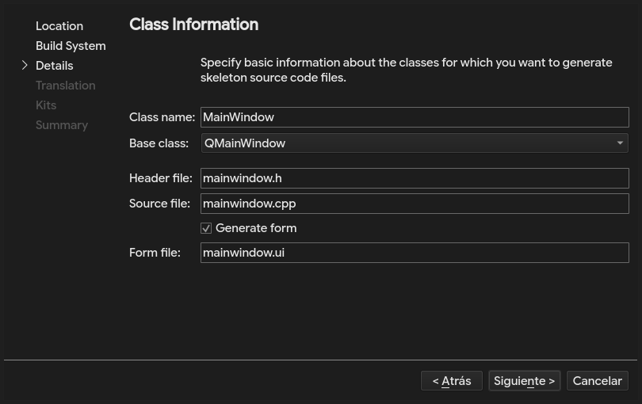
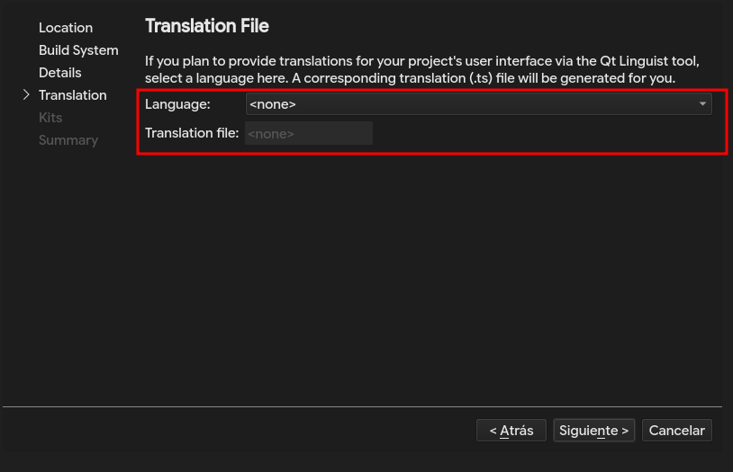
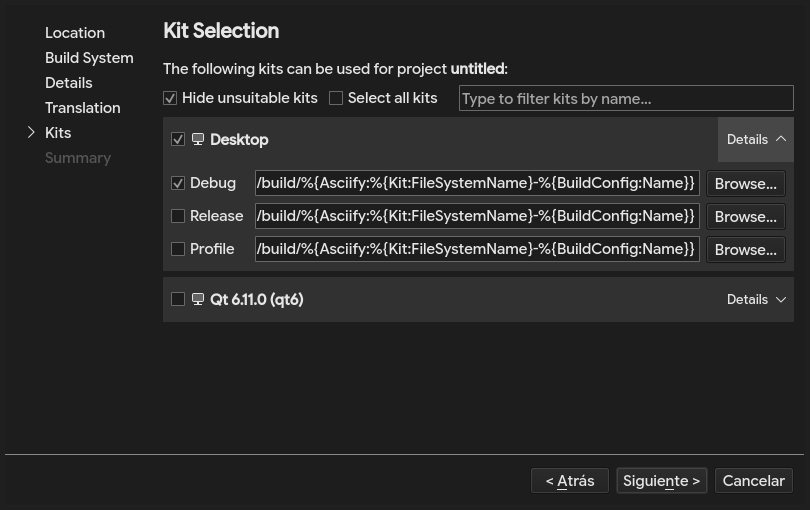
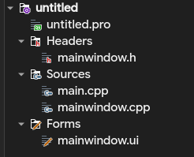
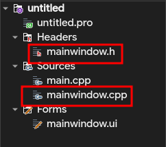
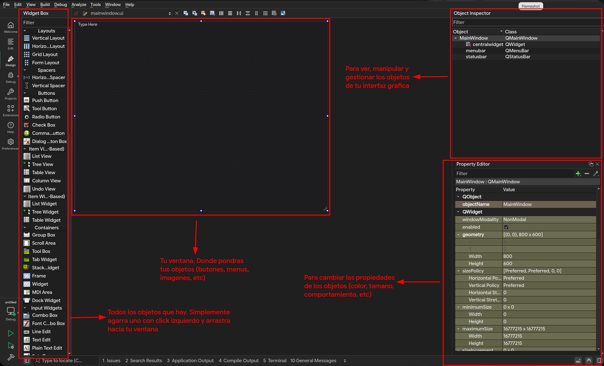

# Paso a paso del Desarrollo del Proyecto: "Sangre de Dioses"
## Asignatura: Informática II
**Desarrollador:** Oscar David Gutiérrez Hernández  
**Entorno de Trabajo:** Qt Creator (C++)  
**Repositorio Oficial:** [sangre-de-dioses (GitHub)](https://github.com/oscargutierrez221/sangre-de-dioses/tree/master/Desarrollo)

---

## Configurar el proyecto en Qt Creator

1. Primero, como en cualquier otro proyecto es necesario crear el proyecto en una carpeta local en tu biblioteca; sea que utilices la biblioteca de windows, o en caso de linux: Dolphin, Thunar, Nemo, etc.

2. En Qt Creator, `File > New File or Project` crea un nuevo proyecto pero esta vez no es necesario crearlo desde `Non-Qt Project`. Solo necesitas crearlo desde `Application (Qt)` y seleccionar la opción `Qt Widgets Application`.

    - Luego de seleccionar `Qt Widgets Application`, entonces tendras que configurar el proyecto con las prefencias que gustes.
        - Nombre del proyecto y ruta del proyecto.
        

        - Kit de compilacion.
        

        - Class Information: Por defecto, trae una clase `MainWindow`, que contendra la logica del apartado visual del programa que estemos desarrollando. Cambialo si asi lo deseas.
        
        - Finalmente, igual que antes podras configurar tanto el idioma, kit de copilacion que prefieras y control de versiones `git`.
        
        

> ⚠️ RECOMENDACION: En lo personal, me gusta mas trabajar con el `build system` `qmake`, ya que es mas sencillo de configurar y entender. Mucho mas que `Cmake`. 

## Que necesitas saber antes de empezar

Una ve creado nuestro proyecto correctamente, podras encontrar muchas cosas extrañas y algunas otras no tanto.



Facilmente puedes observar que siguen conservandose los apartados modulares `headers` y `sources` que ya has trabajado con el `POO`. Pero hay algunas otras cosas que quizas te causen confucion, `MainWindow.h/cpp` y la carpeta `Forms` que contiene `mainwindow.ui`.

Perfecto, pues vamos por partes...



1. `MainWindow.h`: Es la definicion de la clase configurada anteriormente en `Class Information`. Y como mencionamos anteriormente es nuestro gestor de ventanas...

2. `MainWindow.cpp`: Es la implementacion de la clase `MainWindow`.

Si observas el codigo de la clase `MainWindow` encontraras cosas bastantes diferentes a lo que estamos acostumbrados.

`MainWindow.h`
```cpp
#ifndef MAINWINDOW_H
#define MAINWINDOW_H

#include <QMainWindow>

QT_BEGIN_NAMESPACE
namespace Ui {
class MainWindow;
}
QT_END_NAMESPACE

class MainWindow : public QMainWindow
{
    Q_OBJECT

public:
    explicit MainWindow(QWidget *parent = nullptr);
    ~MainWindow() override;

private:
    Ui::MainWindow *ui;
};
#endif // MAINWINDOW_H
```

para poder comprender lo que significan las clases `MainWindow` que incluso hereda de `QMainWindow`. Vamos paso a paso.

1. **La declaración del namespace `Ui`:**
   Al principio del archivo ves esto:
   ```cpp
   namespace Ui {
   class MainWindow;
   }
   ```
   Esto es lo que se conoce como una **declaración hacia adelante (forward declaration)**. Lo que le estamos diciendo al compilador es "Oye, va a existir una clase llamada `MainWindow` dentro del espacio de nombres `Ui`, pero no te preocupes por sus detalles todavía". Esta clase `Ui::MainWindow` es la que Qt genera automáticamente a partir de lo que diseñes en tu archivo visual `mainwindow.ui`. Se hace de esta forma para separar el diseño visual de tu lógica en C++.

2. **La herencia de `QMainWindow`:**
   ```cpp
   class MainWindow : public QMainWindow
   ```
   Nuestra clase `MainWindow` hereda de `QMainWindow`. Esto significa que nuestra ventana tendrá todas las características y comportamientos de una ventana principal estándar de un programa (barra de menús, barra de herramientas, etc.) gracias a la herencia que ya conoces de POO.

3. **La macro `Q_OBJECT`:**
   Al inicio de la clase verás la palabra `Q_OBJECT`. Esta macro es clave en Qt. Si no la pones, no vas a poder usar el sistema de **Señales y Slots** (que sirve para conectar los eventos de tus botones con tus funciones) ni otras herramientas de Qt-Designer. Le avisa al precompilador de Qt que debe preparar esta clase para el entorno gráfico.

4. **El constructor especial:**
   ```cpp
   explicit MainWindow(QWidget *parent = nullptr);
   ```
   - El uso de `explicit` evita que C++ haga conversiones raras o automáticas al crear el objeto.
   - El parámetro `parent` nos sirve para organizar la jerarquía de las ventanas. En Qt, cuando destruyes una ventana "padre", automáticamente se destruyen todas las "hijas" que tenga asociadas. Al ponerle `nullptr` por defecto, le decimos que esta ventana no tiene padre, o sea, que puede abrirse sola como ventana principal.

5. **El puntero `ui`:**
   ```cpp
   Ui::MainWindow *ui;
   ```
   Este puntero es fundamental. Es el puente que conecta tu código con la pantalla. A través de `ui` vas a poder acceder a todo lo que agregues en el diseñador visual (los botones, etiquetas, cuadros de texto, etc.) usando la sintaxis de flecha que ya conoces (por ejemplo, `ui->miBoton->setText(...)`).

> ⚠️ Nota: Pero bueno, verlo de esta forma quizas te sea mas complicado. No te preocupes, es algo que se genera automaticamente al crear el proyecto, no tienes que hacerlo todo tu mismo, pero es bueno saber que es lo que hace para entender de mejor manera el diseñador de interfaz de Qt.

Continuando con los archivos que encontramos al abrir el proyecto entonces tenemos la carpeta `Forms` que contiene `mainwindow.ui` o dicho de otra forma, la ventana de condiguracion de interfaces de Qt `Qt-Designer`.



Aunque puede parecer un poco feo y abrumador al principio, a medida que vamos avanzando veras que es realmente sencillo e intuitivo de usar.