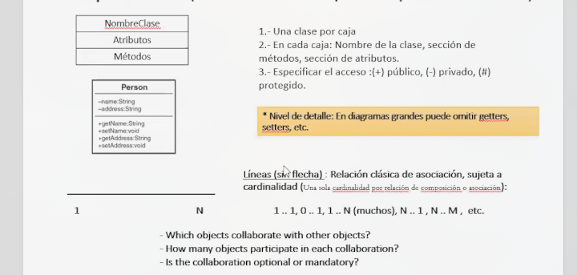
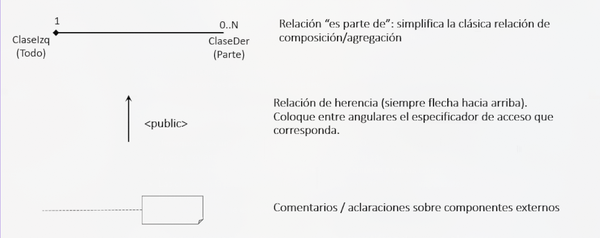
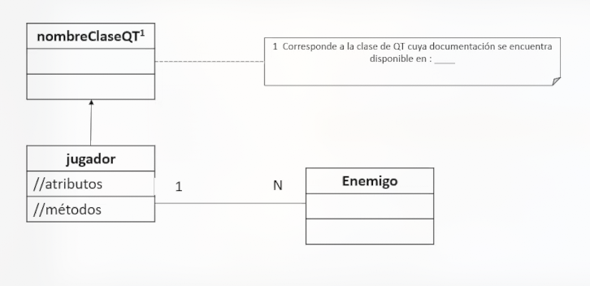
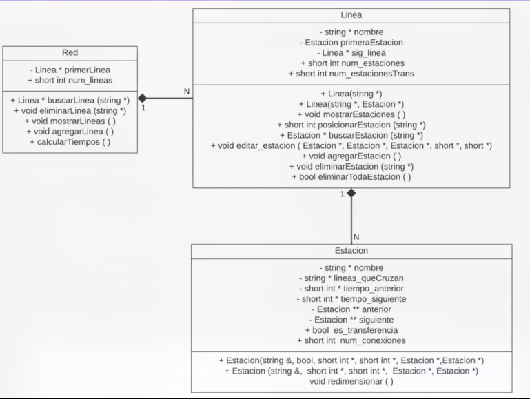
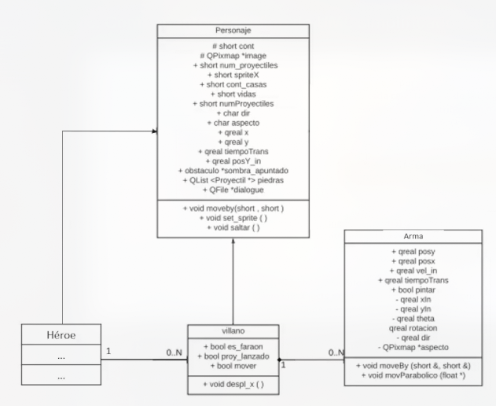

# Clase 8: Diagramas de clase

## 1. Introducción

Los driagramas de clases son una herramienta que nos permite representar de forma gráfica la estructura de un sistema de software. En especifico, nos permiten representar las clases, sus atributos, sus métodos y las relaciones entre ellas.

## 2. Relaciones
- Estan presentes en la realidad y por ende, en cualquier sistema.

- Definen como se producen los intercambios e interacciones de datos.

- Tambien ayudan a comprender las propiedades de unas clases a partir de las propiedades de otras.
- Existen 4 tipos de relaciones:
    - Instanciacion (entre objetos - clases, entre plantillas y sus instancias)
    - Asociacion

    - Es parte de (agregacion y composicion)
    - Herencia

## 3. Relacion de asociacion
- Relacion mas general que denota interacciones o una dependencia semantica
- Es bidireccional

- Primer paaso para determinar una relaacion mas compleja
    ```text
    Ejemplo: Una persona toca un instrumento.
            Un vehiculo recibe combustible de un surtidor
    ```
- **Cardinalidad:** multiplicidad a cada lado de la relacion
    - **Uno a Uno:** `venta-transaccion de pago` - `1..1` (una venta por una transaccion)

    - **Uno a muchos:** `compra-cliente` - `1..1` (Minimo de compra, maximo de compras por cliente)
    - **Muchos a muchos:** `comprador-vendedor` - `N..M`

## 4. Relacion "Es parte de"
- Jerarquia "es parte de", representa relaciones de pertenencia
    - Una **clase contiene** a otra **clase** conviene diferenciar la clase del todo sus partes

> En la literatura se habla de relaacionesd e composicion y agregacion, pero en el curso se simplifica esta idea sin diferenciarlas

Por ejemplo, un carro esta conformado por un motos, una bateria, cuatro llantas, etc. Es decir, si creo una clase `motor` entonces esta tendra varias partes.

## 5. Relacion de herencia
- Jerarquioa "es un" relaciino caracteristica de la POO.
- Puede expresar tanto especiaalizacion como generalizacion.
- Evita definir repetidas veces las caracteristicas comunes a varias clases.
- Las clases en la jerarquia superior en compaion su estructura y componentes a otras clases de jerarquia inferior.
    - Nuevo tipo de encapsulamiento: `protected`

## 6. Componentes (Version de UML simplificado para el curso)


> **NOTA:** No olvidar que para especificar el acceso:
> - `+` publico
> - `-` privado
> - `#` protected



> **NOTA:** Ten demasiado en cuenta el final de las lineas:

**Por ejemplo:**


Un ejemplo mas completo seria


Y otro ejemplo mas para terminar de afianzar los conceptos


